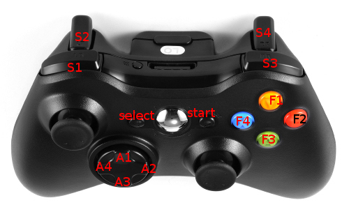

# Joystext Language

Is a compiler that takes the Joystext high level language (as source) and outputs the corresponding Joystext configuration language (as target).

Joystext allows you to use you XBox 360 joystick as keyboard and mouse for computers. More supported joystiscks are to come.

## Run a sample config

Plug your XBox 360 joystick and run:
```
$ bundle exec ruby compile.rb samples/simple-nav > ~/.joystext
$ PATH_TO/joystext ~/.joystext
```
You should be able to move your mouse and left click.

Evidently, you need to have joystext binary somewhere in your machine.

## Syntax

Each configuration definition has three parts: the trigger type, the trigger name (joystick key) and an action to be performed.
So the line in our example:

`>F1: click_left`

means 'whenever theres a press on the key F1 of the joystick, run the command click_left', and that is going to trigger the left button click of a mouse.


### Trigger names

`F1, F2, F3, F4, A1, A2, A3, A4, S1, S2, S3, S4, start, select` are the buttons in the joystick that are supported for now, mapped according to the image:



(Memorization tip: `F` is for the 'face buttons', `A` is for the Axis buttons, `S` is for the shoulder buttons)


### Trigger types

Its the way a joystick button behaves when pressed/released.

There are 5 types of triggers:

`*F1` triggers when pressed, than waits for a while, then repeats the action (kind of what a normal keyboard does, try holding the 'g'key on a text editor to see what I mean)

`>F1` triggers once when the key is pressed, no matter how long it is held, triggers only once, ignore combinations.

`<F1` triggers when the key is released but ignore combinations.

`F1` triggers when the key is realeased. (this is usefull for combining keys).

`.F1` triggers repeatedly for as long as the key is held (with no waiting).

### Modes

Modes are groups of definitions, so you can have a mode for writing text, another for mouse and yet another for macros.

Modes are defined with:

`mode 'macros'`

Than whatever comes after this line is in the mode named 'macros'

The command `switch_to_mode` is used to define how one can enter the mode:

```
mode 'macros'

.F1 "thanks"
select: switch_to_mode 'text'

mode 'text'

.F1: a
start:switch_to_mode 'macros'
```

In the above example, whenever the user presses the `start` button on the joystick, it will rebind all the commands accoding to the mode defition for 'macros'.

### Remaps

TODO